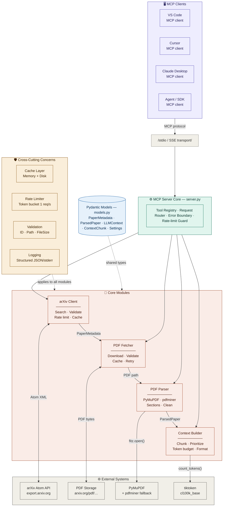
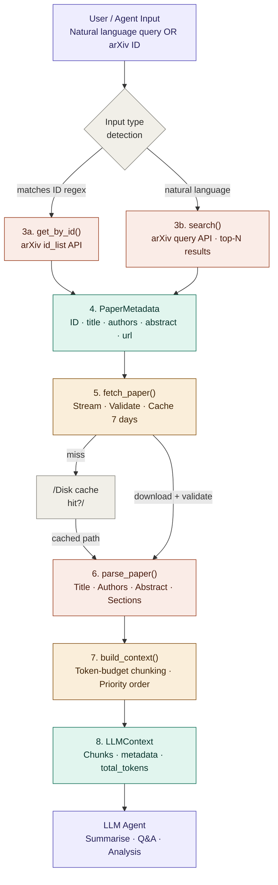

# arxiv-mcp

> A production-grade Model Context Protocol server for autonomous arXiv paper retrieval, PDF extraction, and LLM-ready context preparation.

---

## Table of Contents

1. [System Architecture](#1-system-architecture)
2. [Installation & Setup](#2-installation--setup)
3. [Dependency Management](#3-dependency-management)
4. [MCP Configuration](#4-mcp-configuration)
5. [Tool Interface Definitions](#5-tool-interface-definitions)
6. [End-to-End Workflow](#6-end-to-end-workflow)
7. [Full Implementation Reference](#7-full-implementation-reference)
8. [Example Usage](#8-example-usage)
9. [Rate Limiting & arXiv API Constraints](#9-rate-limiting--arxiv-api-constraints)
10. [Error Handling](#10-error-handling)
11. [Troubleshooting](#11-troubleshooting)

---

## 1. System Architecture



---

## Data Flow Diagram



---

### Module Responsibilities

| Module | File | Responsibility |
|--------|------|---------------|
| `models` | `src/models.py` | Shared Pydantic models + config constants |
| `logger` | `src/logger.py` | Structured logging (structlog) |
| `arxiv_client` | `src/arxiv_client/__init__.py` | arXiv API search, metadata retrieval, ID detection |
| `pdf_fetcher` | `src/pdf_fetcher/__init__.py` | PDF download with caching, retry, streaming |
| `pdf_parser` | `src/pdf_parser/__init__.py` | PDF text extraction + token-aware chunking |
| `context_builder` | `src/context_builder/__init__.py` | LLM-ready context packaging |
| `mcp_server` | `src/mcp_server/__init__.py` | MCP tool definitions and request routing |

### Data Flow

```
User / LLM Query
      │
      ▼
  search_arxiv(query)
      │
      ├─ Contains arXiv ID? ──► get_paper_by_id(id) ──► PaperMetadata
      └─ Natural language? ───► arXiv API search ──────► [SearchResult]
                                                               │
                                                    download_pdf(id)
                                                               │
                                                    local PDF cache
                                                               │
                                                    extract_text(id)
                                                               │
                                                    ExtractedPaper
                                                    (chunks + full text)
                                                               │
                                                    get_paper_context(id)
                                                               │
                                                    PaperContext
                                                    (system_prompt + chunks)
                                                               │
                                                    ◄── LLM uses for QA /
                                                         summarization
```

---

## 2. Installation & Setup

### Prerequisites

- Python 3.11+
- pip

### Quick Start (Local Source)

```bash
# 1. Clone the project
git clone <your-repo-url>
cd arxiv-mcp

# 2. Create and activate virtual environment (recommended)
python -m venv .venv
source .venv/bin/activate        # macOS/Linux
.venv\Scripts\activate         # Windows

# 3. Install dependencies
pip install -r requirements.txt

# 4. Configure environment
cp .env.example .env
# Edit .env if needed (defaults work out of the box)

# 5. Verify installation
python test_smoke.py
```

### Install from TestPyPI / PyPI (Recommended for users)

```bash
# Install package from TestPyPI (for pre-release testing)
pip install --index-url https://test.pypi.org/simple/ --extra-index-url https://pypi.org/simple arxiv-mcp-aj

# Or install package from production PyPI
pip install arxiv-mcp-aj

# Check command works
arxiv-mcp --help

# Run built-in smoke test ✓
python -m arxiv_mcp  # or `python test_smoke.py` (if source present)
```

### If you are already on a published version (0.1.3)

- `pip install arxiv-mcp-aj==0.1.3`
- `arxiv-mcp --help`

---

### Directory Structure

```
arxiv-mcp/
├── src/
│   ├── __init__.py
│   ├── console.py            # CLI entrypoint module
│   ├── models.py             # Pydantic models + config
│   ├── logger.py             # Structured logging
│   ├── arxiv_client/
│   │   └── __init__.py       # arXiv API wrapper
│   ├── pdf_fetcher/
│   │   └── __init__.py       # PDF downloader
│   ├── pdf_parser/
│   │   └── __init__.py       # PDF text extractor
│   ├── context_builder/
│   │   └── __init__.py       # LLM context packager
│   └── mcp_server/
│       ├── __init__.py       # MCP server + tool handlers
│       └── __main__.py       # python -m entry point
├── tests/
│   └── test_smoke.py         # Smoke test suite
├── downloads/                # PDF cache (auto-created) unless ARXIV_DOWNLOAD_DIR set
├── .vscode/mcp.json          # workspace MCP config
├── pyproject.toml            # package metadata and CLI entrypoint
├── Dockerfile                # containerized server deployment
├── .env.example              # Environment template
├── mcp.json                  # MCP client configuration
├── requirements.txt          # Python dependencies
└── README.md                 # This file
```

---

## 3. Dependency Management

### Core Dependencies

| Package | Version | Purpose |
|---------|---------|---------|
| `mcp` | ≥1.0.0 | Model Context Protocol framework |
| `arxiv` | ≥2.1.0 | Official arXiv Python API wrapper |
| `httpx` | ≥0.27.0 | Async HTTP client for PDF streaming |
| `pymupdf` | ≥1.24.0 | PDF text extraction (PyMuPDF / fitz) |
| `pydantic` | ≥2.0.0 | Data validation and serialization |
| `tenacity` | ≥8.2.0 | Retry logic with exponential backoff |
| `tiktoken` | ≥0.7.0 | Token counting (OpenAI cl100k_base) |
| `structlog` | ≥24.0.0 | Structured JSON logging |
| `aiofiles` | ≥23.0.0 | Async file I/O |
| `python-dotenv` | ≥1.0.0 | `.env` file loading |
| `anyio` | ≥4.0.0 | Async I/O compatibility layer |

Install all:
```bash
pip install -r requirements.txt
```

---

## 4. MCP Configuration

### `mcp.json` (for VS Code, Cursor, Claude Desktop)

Place `mcp.json` in your project root or workspace. The MCP client (VS Code Copilot, Cursor, Claude Desktop) will read this file automatically.

```json
{
  "mcpServers": {
    "arxiv-mcp": {
      "command": "python",
      "args": ["-m", "src.mcp_server"],
      "cwd": "${workspaceFolder}",
      "env": {
        "PYTHONPATH": "${workspaceFolder}",
        "ARXIV_DOWNLOAD_DIR": "${workspaceFolder}/downloads",
        "CHUNK_SIZE_TOKENS": "800",
        "CHUNK_OVERLAP_TOKENS": "100",
        "ARXIV_RATE_LIMIT_DELAY": "3.0",
        "MAX_RETRIES": "3",
        "HTTP_TIMEOUT": "60"
      }
    }
  }
}
```

### VS Code Setup

1. Install the **MCP** extension or use **GitHub Copilot** with MCP support.
2. Place `mcp.json` at workspace root.
3. Reload VS Code window.
4. The `arxiv-mcp` server will appear in your MCP server list.

### Cursor Setup

1. Open **Settings → MCP Servers**.
2. Add entry pointing to your project's `mcp.json`, or manually configure:
   - Command: `python -m src.mcp_server`
   - Working directory: your project root
   - Environment: set `PYTHONPATH` to your project root
3. Enable the server and restart Cursor.

### Claude Desktop Setup

Add to `~/Library/Application Support/Claude/claude_desktop_config.json` (macOS) or `%APPDATA%\Claude\claude_desktop_config.json` (Windows):

```json
{
  "mcpServers": {
    "arxiv-mcp": {
      "command": "python",
      "args": ["-m", "src.mcp_server"],
      "cwd": "/absolute/path/to/arxiv-mcp",
      "env": {
        "PYTHONPATH": "/absolute/path/to/arxiv-mcp"
      }
    }
  }
}
```

> **Note:** Use absolute paths in Claude Desktop config.

---

## 5. Tool Interface Definitions

### `search_arxiv`

Search arXiv using natural language or an arXiv ID.

**Input:**
```json
{
  "query": "string",       // required — natural language or arXiv ID
  "max_results": "integer" // optional — 1-50, default 10
}
```

**Output:**
```json
{
  "query": "attention transformer NLP",
  "total_found": 3,
  "results": [
    {
      "arxiv_id": "1706.03762",
      "title": "Attention Is All You Need",
      "authors": ["Ashish Vaswani", "Noam Shazeer", "..."],
      "abstract_snippet": "The dominant sequence transduction models...",
      "published": "2017-06-12T00:00:00+00:00",
      "categories": ["cs.CL", "cs.LG"],
      "pdf_url": "https://arxiv.org/pdf/1706.03762.pdf"
    }
  ]
}
```

---

### `get_paper_by_id`

Fetch complete metadata for a single paper.

**Input:**
```json
{
  "arxiv_id": "string"   // required — e.g. "2603.17216"
}
```

**Output:**
```json
{
  "arxiv_id": "1706.03762",
  "title": "Attention Is All You Need",
  "authors": [{"name": "Ashish Vaswani"}, {"name": "Noam Shazeer"}],
  "abstract": "The dominant sequence transduction models are based on...",
  "categories": ["cs.CL", "cs.LG"],
  "primary_category": "cs.CL",
  "published": "2017-06-12T17:57:34+00:00",
  "updated": "2023-08-02T00:00:00+00:00",
  "pdf_url": "https://arxiv.org/pdf/1706.03762.pdf",
  "entry_url": "http://arxiv.org/abs/1706.03762v5",
  "comment": "15 pages, 5 figures",
  "journal_ref": null
}
```

---

### `download_pdf`

Download the paper PDF to local cache.

**Input:**
```json
{
  "arxiv_id": "string",  // required
  "force": "boolean"     // optional, default false — re-download if cached
}
```

**Output:**
```json
{
  "arxiv_id": "1706.03762",
  "local_path": "/path/to/downloads/1706.03762.pdf",
  "file_size_bytes": 2048000,
  "success": true,
  "error": null
}
```

---

### `extract_text`

Parse a paper PDF and return structured text with chunks.

**Input:**
```json
{
  "arxiv_id": "string"  // required
}
```

**Output:**
```json
{
  "arxiv_id": "1706.03762",
  "title": "Attention Is All You Need",
  "total_pages": 15,
  "extraction_method": "pymupdf",
  "full_text_length_chars": 58432,
  "chunk_count": 24,
  "total_tokens": 14200,
  "first_500_chars": "Attention Is All You Need\n\nAshish Vaswani...",
  "chunks_preview": [
    {
      "chunk_index": 0,
      "token_count": 800,
      "section_hint": "Abstract",
      "preview": "The dominant sequence transduction models..."
    }
  ]
}
```

---

### `get_paper_context`

Full LLM-ready context bundle — the primary tool for paper analysis.

**Input:**
```json
{
  "arxiv_id": "string",    // required
  "max_chunks": "integer"  // optional — limit chunks for token budget
}
```

**Output:**
```json
{
  "arxiv_id": "1706.03762",
  "metadata": { "...full metadata..." },
  "llm_system_prompt": "You are a research assistant analyzing...",
  "summary_prompt": "Please provide a comprehensive summary...",
  "total_tokens": 14200,
  "chunk_count": 24,
  "chunks": [
    {
      "chunk_index": 0,
      "text": "The dominant sequence transduction models...",
      "token_count": 800,
      "section_hint": "Abstract"
    }
  ]
}
```

---

## 6. End-to-End Workflow

### Workflow 1: Discover and Summarize

```
User: "Summarize the latest papers on debugging AI agents"

LLM calls:  search_arxiv(query="debugging AI agents", max_results=5)
            → Returns 5 papers with titles, abstracts, IDs

LLM calls:  get_paper_context(arxiv_id="2603.14688")
            → Downloads PDF, extracts text, returns chunked context
              with system prompt and summary prompt

LLM:        Reads context, produces structured summary
            covering problem statement, methodology, results
```

### Workflow 2: Deep-Dive on Specific Paper

```
User: "Explain how paper 2603.17216 trains ML agents"

LLM calls:  get_paper_by_id(arxiv_id="2603.17216")
            → Title: "AI Scientist via Synthetic Task Scaling"
            → Authors, abstract, categories

LLM calls:  get_paper_context(arxiv_id="2603.17216")
            → Full chunked text ready for analysis

LLM:        Answers question using paper context
```

### Workflow 3: Comparative Analysis

```
User: "Compare BERT and GPT-2 architectures"

LLM calls:  search_arxiv(query="BERT pre-training language model")
            → Gets arxiv_id for BERT paper (1810.04805)

LLM calls:  search_arxiv(query="GPT-2 language model OpenAI")
            → Gets arxiv_id for GPT-2 paper (2005.14165)

LLM calls:  get_paper_context(arxiv_id="1810.04805", max_chunks=10)
LLM calls:  get_paper_context(arxiv_id="2005.14165", max_chunks=10)

LLM:        Produces side-by-side comparison using both contexts
```

---

## 7. Full Implementation Reference

### Environment Variables

| Variable | Default | Description |
|----------|---------|-------------|
| `ARXIV_DOWNLOAD_DIR` | `./downloads` | Local PDF cache directory |
| `ARXIV_MAX_RESULTS` | `10` | Default search result count |
| `CHUNK_SIZE_TOKENS` | `800` | Tokens per text chunk |
| `CHUNK_OVERLAP_TOKENS` | `100` | Token overlap between chunks |
| `ARXIV_RATE_LIMIT_DELAY` | `3.0` | Seconds between API calls |
| `MAX_RETRIES` | `3` | Retry attempts on failure |
| `HTTP_TIMEOUT` | `60` | HTTP request timeout (seconds) |
| `LOG_LEVEL` | `INFO` | Logging verbosity |

### Chunking Strategy

The PDF text is split using tiktoken with `cl100k_base` encoding (same as GPT-4):

- **Chunk size:** 800 tokens (configurable)
- **Overlap:** 100 tokens between adjacent chunks (prevents context loss at boundaries)
- **Section hints:** The first line of each chunk is checked against known academic section header patterns and stored as `section_hint`
- **Fallback:** If tiktoken fails, falls back to character-based chunking (~4 chars/token)

### PDF Caching

PDFs are cached in `ARXIV_DOWNLOAD_DIR` as `{arxiv_id}.pdf`. Subsequent calls to `download_pdf` or `extract_text` for the same ID are instant (no network request). Use `force=true` in `download_pdf` to bypass cache.

---

## 8. Example Usage

### From Claude Desktop

After configuring `mcp.json`, you can prompt Claude:

```
"Search arXiv for recent papers on multi-agent reinforcement learning 
 and give me a full context for the most relevant one."
```

Claude will automatically call `search_arxiv`, then `get_paper_context`.

### From Cursor / VS Code

In the chat panel with MCP enabled:

```
@arxiv-mcp search for papers about vision transformers

@arxiv-mcp get the full context for paper 2010.11929
```

### Direct Python Usage

```python
import asyncio
from src.arxiv_client import ArxivClient
from src.pdf_fetcher import PDFFetcher
from src.pdf_parser import PDFParser
from src.context_builder import ContextBuilder

async def main():
    client = ArxivClient()
    parser = PDFParser()
    builder = ContextBuilder()

    # Search
    results = await client.search("vision transformer ViT", max_results=5)
    paper_id = results[0].arxiv_id

    # Get metadata
    meta = await client.get_by_id(paper_id)

    # Download & parse
    async with PDFFetcher() as fetcher:
        dl = await fetcher.download(paper_id)

    extracted = parser.parse(dl.local_path, paper_id)

    # Build LLM context
    context = builder.build(meta, extracted)
    print(context.llm_system_prompt)
    print(f"Total tokens: {context.total_tokens}")

asyncio.run(main())
```

### Running the Server Directly

```bash
# From project root
PYTHONPATH=. python -m src.mcp_server
```

The server runs on stdio and is intended to be spawned by an MCP client.

---

## 9. Rate Limiting & arXiv API Constraints

arXiv's Terms of Service require automated clients to:

- Wait **at least 3 seconds** between API requests
- Not make more than **1 request every 3 seconds** to the Atom feed

The server enforces this automatically via an async rate limiter in `arxiv_client`. The `ARXIV_RATE_LIMIT_DELAY` environment variable controls the minimum delay (default: 3.0 seconds).

PDF downloads go through `https://arxiv.org/pdf/` which has separate (more lenient) rate limits. The server uses httpx with streaming to avoid memory pressure on large PDFs.

---

## 10. Error Handling

Every tool returns a structured JSON error on failure instead of crashing:

```json
{
  "error": "PDF not found on arXiv (404): https://arxiv.org/pdf/9999.99999.pdf",
  "tool": "download_pdf",
  "type": "FileNotFoundError"
}
```

### Error scenarios handled

| Scenario | Behavior |
|----------|----------|
| Invalid arXiv ID | Returns `{"error": "Paper not found: ..."}` |
| 404 on PDF | Raises `FileNotFoundError`, not retried |
| Network timeout | Retried up to `MAX_RETRIES` times with exponential backoff |
| Corrupted PDF | `PDFParser` raises `ValueError` with description |
| Rate limit hit | Automatic delay applied before retry |
| Unknown tool name | Returns structured error response |

---

## 11. Troubleshooting

### "Paper not found" for a valid ID

arXiv sometimes has propagation delays for newly submitted papers. Wait a few hours and try again.

### PDF download fails with content-type error

arXiv serves HTML for some papers that are still processing. Wait and retry, or access the paper directly at `https://arxiv.org/abs/{id}` to check its status.

### Chunking returns fewer chunks than expected

If the paper PDF is mostly figures with little text (common in some CS papers), the extracted text will be short. This is expected behavior — the full_text will still be complete.

### MCP server not appearing in VS Code/Cursor

1. Confirm `mcp.json` is in the workspace root.
2. Confirm `PYTHONPATH` points to the project root so `src` is importable.
3. Check that the virtual environment's `python` is used (set `command` to the absolute path of `python` in your venv).
4. Look at MCP server logs (stderr) for import errors.

### tiktoken download fails

tiktoken downloads tokenizer data on first use. If your environment has no internet access:

```bash
# Pre-download the encoding
python -c "import tiktoken; tiktoken.get_encoding('cl100k_base')"
```

Then the data is cached locally.
